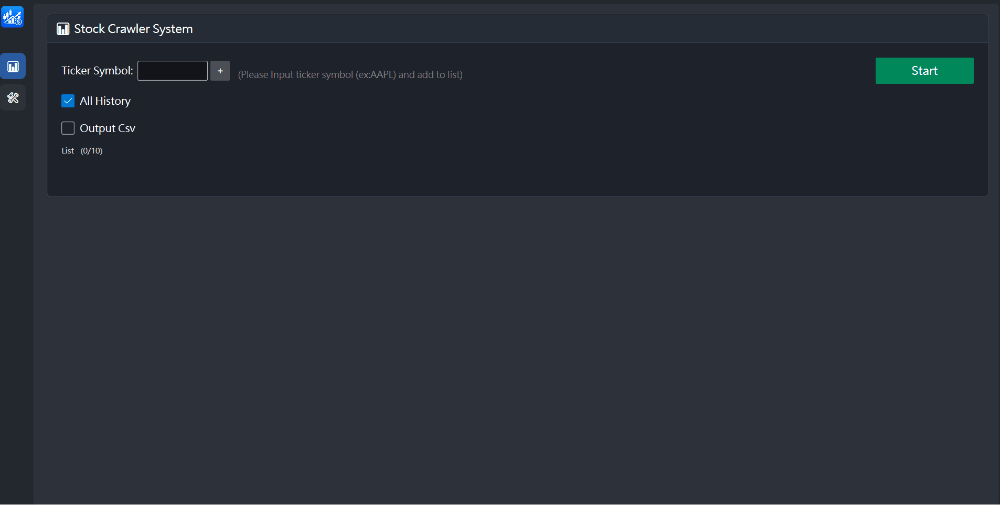
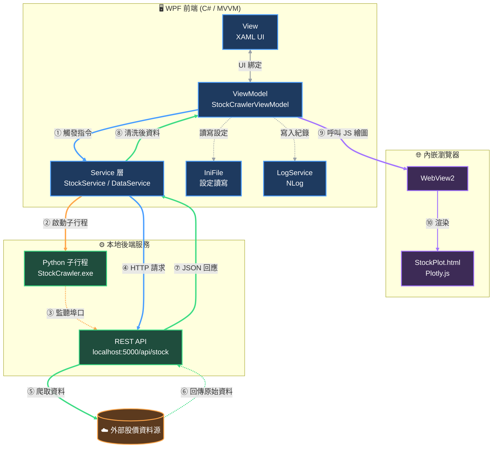

# 📊 StockAssist｜股票助理

這是一套 **Windows 桌面應用程式**，讓使用者輸入股票代號後，一鍵抓取歷史股價資料、繪製互動式走勢圖，並可匯出 CSV股價資料。前端以 **WPF (MVVM)** 打造介面，後端以 **Python 服務**負責資料爬取，兩者透過 **本地 REST API** 溝通，並用內嵌瀏覽器 **WebView2 + Plotly.js** 呈現圖表，達成「C# 桌面體驗」與「Python 資料爬取」的優勢互補。



---

## ➣ 功能特色

- **多檔股票查詢**：輸入 Ticker（如 `AAPL`）加入清單，一次批次抓取多檔資料
- **互動式走勢圖**：內嵌瀏覽器即時繪製股價走勢圖，支援縮放、互動資訊
- **CSV 匯出**：可自訂輸出路徑與日期格式，將清理後的資料存檔
- **資料清洗**：自動過濾錯誤代號、缺值 / NaN 資料，並回報給使用者
- **多國語言介面**：內建繁中／簡中／日文／英文四種語系，可即時切換
- **設定持久化**：使用者偏好（代號清單、日期區間、輸出路徑等）寫入 INI 檔，下次啟動自動還原
- **背景服務自我保護**：啟動前自動偵測並清除殘留的爬蟲子行程，避免 Port 被佔用

---

## ➣ 技術架構

| 分類 | 技術 / 套件 | 說明 |
|---|---|---|
| 桌面框架 | **WPF (.NET)** | Windows 原生 UI 框架 |
| 設計模式 | **MVVM**、`CommunityToolkit.Mvvm` | `ObservableObject` / `RelayCommand` / `AsyncRelayCommand`，View 與邏輯解耦 |
| UI 元件庫 | **ModernWpf** | Fluent Design 風格控制項 |
| 跨程序通訊 | **Process 管理 + 本地 HTTP REST API** | C# 以 `System.Diagnostics.Process` 啟動打包好的 Python `.exe`，再透過 `HttpClient` 呼叫 `http://localhost:5000/api/stock` |
| 內嵌瀏覽器 | **WebView2** | 承載本地 HTML，透過 `ExecuteScriptAsync` 讓 C# 呼叫前端 JS 函式 |
| 圖表渲染 | **Plotly.js** | 於 WebView2 中繪製互動式股價走勢圖 |
| 資料格式 | **JSON**（`Newtonsoft.Json`） | C# ↔ Python 資料交換格式，並用於資料清洗（過濾 NaN／錯誤代號） |
| 設定管理 | **INI 檔 + `Microsoft.Extensions.Configuration`** | 讀寫使用者設定並綁定成強型別物件 |
| 日誌系統 | **NLog** | 分級記錄（Info / Warn / Fatal），Singleton 模式管理、依日期歸檔、自動輪替 |
| 多國語言 | **JSON 語言資源檔 + `ObservableObject`** | 動態切換語系並即時通知 UI 更新綁定文字 |
| 匯出格式 | **CSV** | 自訂日期格式輸出乾淨資料 |

---

## ➣ 系統架構圖


 
**圖例說明：**
 
| 顏色 | 意義 |
|---|---|
| 🔵 藍色 | 前端內部指令 / HTTP 請求 |
| 🟠 橘色 | 行程控制（啟動 / 監聽） |
| 🟢 綠色 | 資料抓取與回傳（含清理後資料） |
| 🟣 紫色 | 圖表渲染相關呼叫 |
| ⚪ 灰色（虛線） | 次要動作：UI 綁定、設定讀寫、日誌寫入 |


**資料流程摘要：**
1. 使用者於 UI 輸入 Ticker → `ViewModel` 觸發 `StartCommand`
2. `StockService` 透過 `Process.Start` 啟動打包好的 Python 後端（若有殘留行程會先強制清除）
3. 前端以 `HttpClient` 呼叫本地 REST API 取得股價 JSON
4. `DataService` 清洗資料（過濾 NaN / 錯誤代號 / 資料筆數不足者）
5. 清洗後的 JSON 經 `WebView2.ExecuteScriptAsync` 傳給前端 JS，由 **Plotly.js** 即時繪圖
6. 使用者可選擇將乾淨資料匯出為 CSV，設定值同步寫回 INI 檔

---

## ➣ 專案結構

```
StockAssist/
├── IniParser/               # INI 設定讀寫（IniConfig / IniFile）
├── Languages/               # 多語系資源與 LanguageService
├── LogManager/              # NLog 封裝（Singleton LogService）
├── MainWindow/              # 主視窗 View / ViewModel（導覽、選單）
├── Setting/                 # 系統設定頁 View / ViewModel
├── StockCrawler/
│   ├── Python/              # Python子行程 (StockCrawler.exe)
│   ├── Models/              # IStockService / StockService（Process + HTTP）
│   ├── Services/            # IDataService / IDialogService（資料清洗、對話框）
│   ├── ViewModels/          # StockCrawlerViewModel（核心爬蟲業務邏輯）
│   ├── Views/               # StockCrawler.xaml（嵌入 WebView2）
│   └── Draw/StockPlot.html  # Plotly.js 繪圖頁
└── App.xaml                 # 應用程式進入點
```